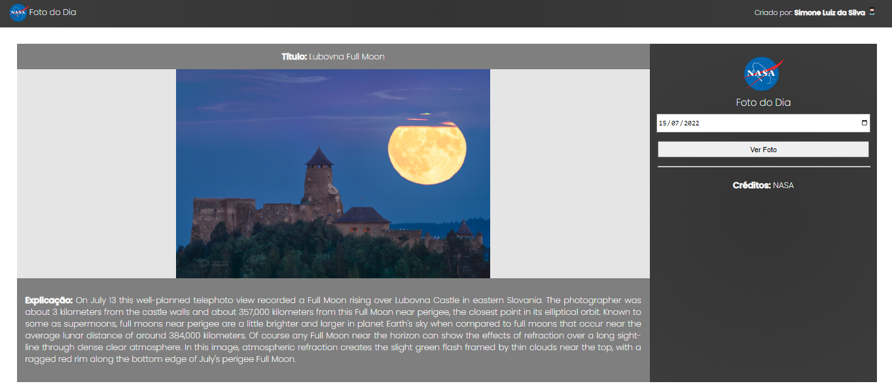

# PROJETO-MODULO-02-API-NASA
<h1 align="center">:file_cabinet: "Astronomy Picture of the Day" (APOD)" </h1>
# *é uma API que fornece uma foto ou vídeo, diariamente, para que as pessoas consigam descobrir um pouco mais sobre o espaço.
Você pode colocar a data da sua preferência na caixa de entrada do lado direito da tela, e de acordo a data escolhida aparecerá
a foto do dia, selecionada pela Nasa.*

## :wrench: *Tecnologias utilizadas*
* JavaScript*
* Css*
* jQuery*

# 🌚 *Imagens*
   
